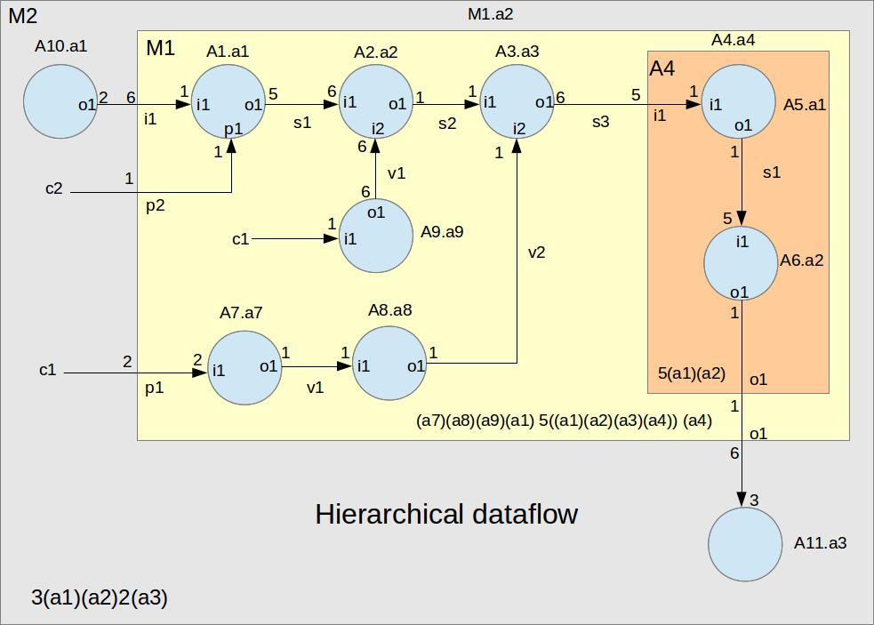

**The author:** ***Dr.Janos Selmeczi, HA5FT***. You could reach me at <ha5ft.jani@freemail.hu>
***
# Trying the M2 dataflow
This dataflow demonstrate the schedulink capabilities of the sdrflow framework. This dataflow has a nonrivial schedule. Its primitives keep track how many times they interface functions have been invoked. They interface functions print a message to the console, that the function has been invoked.
## Block diagram of the dataflow
This is a hierarchical dataflow. The next diagrams show its components.



The data flow uses 3 composites: M2, M1 and A4.
It uses 10 primitives: A1, A2, A3, A5, A6, A7, A8, A9, A10 and A11.
In the M1 composite there is a virtual subgraph for processing parameters.

## Run the M2 dataflow

 You could run the M2 dataflow using the framework's runtime applications.

 ```bash
# You shoud be in the sdrflow directory
> ./bin/sdfrun
sdrflow runtime version 0.1
sdrflow>load /M2/m2
A1: loaded
A2: loaded
A3: loaded
A5: loaded
A6: loaded
A7: loaded
A8: loaded
A9: loaded
A10: loaded
A11: loaded
A10: a1 initialized
A1: a1 initialized
A2: a2 initialized
A3: a3 initialized
A5: a1 initialized
A6: a2 initialized
A7: a7 initialized
A8: a8 initialized
A9: a9 initialized
A11: a3 initialized
OK
sdrflow>run /m2 1
A10: a1 fired fire_count=1
A10: a1 fired fire_count=2
A10: a1 fired fire_count=3
A7: a7 fired fire_count=1
A8: a8 fired fire_count=1
A9: a9 fired fire_count=1
A1: a1 fired fire_count=1
A1: a1 fired fire_count=2
A2: a2 fired fire_count=1
A3: a3 fired fire_count=1
A5: a1 fired fire_count=1
A5: a1 fired fire_count=2
A5: a1 fired fire_count=3
A5: a1 fired fire_count=4
A5: a1 fired fire_count=5
A6: a2 fired fire_count=1
A1: a1 fired fire_count=3
A2: a2 fired fire_count=2
A3: a3 fired fire_count=2
A5: a1 fired fire_count=6
A5: a1 fired fire_count=7
A5: a1 fired fire_count=8
A5: a1 fired fire_count=9
A5: a1 fired fire_count=10
A6: a2 fired fire_count=2
A1: a1 fired fire_count=4
A2: a2 fired fire_count=3
A3: a3 fired fire_count=3
A5: a1 fired fire_count=11
A5: a1 fired fire_count=12
A5: a1 fired fire_count=13
A5: a1 fired fire_count=14
A5: a1 fired fire_count=15
A6: a2 fired fire_count=3
A1: a1 fired fire_count=5
A2: a2 fired fire_count=4
A3: a3 fired fire_count=4
A5: a1 fired fire_count=16
A5: a1 fired fire_count=17
A5: a1 fired fire_count=18
A5: a1 fired fire_count=19
A5: a1 fired fire_count=20
A6: a2 fired fire_count=4
A1: a1 fired fire_count=6
A2: a2 fired fire_count=5
A3: a3 fired fire_count=5
A5: a1 fired fire_count=21
A5: a1 fired fire_count=22
A5: a1 fired fire_count=23
A5: a1 fired fire_count=24
A5: a1 fired fire_count=25
A6: a2 fired fire_count=5
A5: a1 fired fire_count=26
A5: a1 fired fire_count=27
A5: a1 fired fire_count=28
A5: a1 fired fire_count=29
A5: a1 fired fire_count=30
A6: a2 fired fire_count=6
A11: a3 fired fire_count=1
A11: a3 fired fire_count=2
OK
sdrflow>unload /m2
A10: a1 cleaned up
A1: a1 Cleaned up
A2: a2 cleaned up
A3: a3 cleaned up
A5: a1 cleaned up
A6: a2 cleaned up
A7: a7 cleaned up
A8: a8 cleaned up
A6: a9 cleaned up
A6: a3 cleaned up
A1: deleted
A2: deleted
A3: deleted
A5: deleted
A6: deleted
A7: deleted
A8: deleted
A9: deleted
A10: deleted
A11: deleted
OK
sdrflow>exit
>
 ```
 The above terminal session shows you how the entry functions of a primitive have been invoked.
 - The runtime first call the ***load()*** function.
 - Next the ***init()*** function will be called.
 - After that the runtime calls the ***fire()*** function according to the schedule.
 - After the schedule has been stoped the runtime calls the ***cleanup()*** function.
 - Finally the unload ***delete()*** function has been called.
